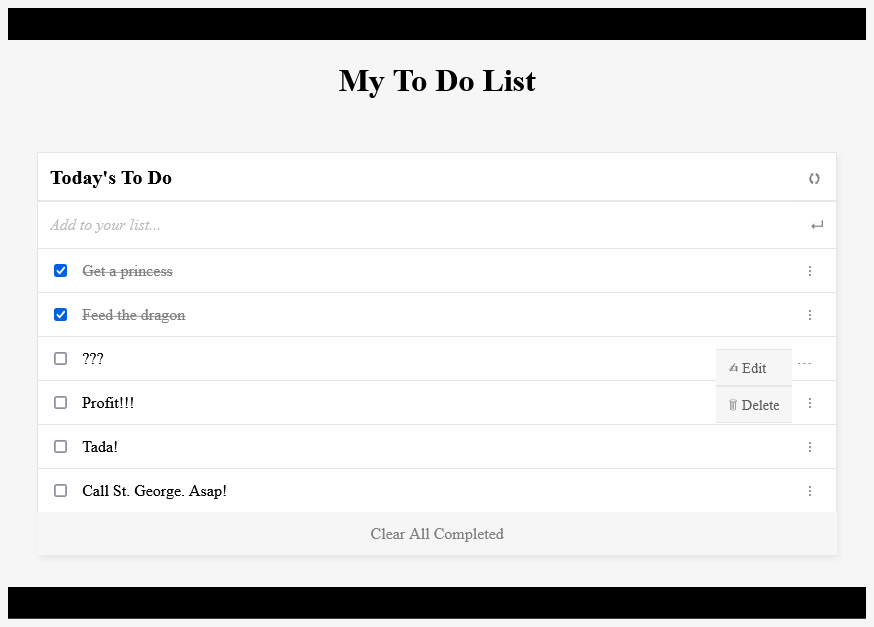

# To Do List

> A list of all the things you have yet to do.

Additional description about the project and its features.

## Built With

- Html, CSS, JavaScript
- Webpack

## Live Demo

[Live Demo Link](https://qwibbler.github.io/todo-list/)

## Getting Started

**This is an example of how you may give instructions on setting up your project locally.**
**Modify this file to match your project, remove sections that don't apply. For example: delete the testing section if the currect project doesn't require testing.**

To get a local copy up and running follow these simple example steps.

### Prerequisites
- Node.js

### Setup
- Clone the repository.

### Install
1. `cd` into the repository's folder.
2. Enter `npm install` into the terminal.
3. Enter `npm run build` into the terminal.
3. Run the dist\index.html file.

## Authors

👤 **Humaira Zaman**

- GitHub: [@qwibbler](https://github.com/qwibbler)
- Twitter: [@hmemaz](https://twitter.com/hmemaz)
- LinkedIn: [Humaira Zaman](https://www.linkedin.com/in/hmemaz1994/)

## 🤝 Contributing

Contributions, issues, and feature requests are welcome!

Feel free to check the [issues page](../../issues/).

## Show your support

Give a ⭐️ if you like this project!

## Acknowledgments

- Hat tip to Microverse who inspired this project.

## 📝 License

This project is [MIT](./LICENSE) licensed.
